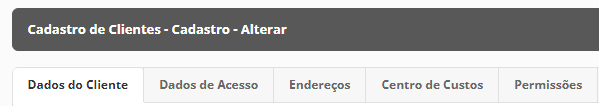

# Database

## FAQ

O FAQ  vem de *“Frequently Asked Questions”* e é uma ferramenta que tem a finalidade de responder previamente questões que seu cliente pode fazer, poupando tempo e agilizando o processo de suporte ao cliente. Todos os FAQs cadastrados na sua Loja da **Universo Ink** serão exibidos no rodapé da loja, na área de **Dúvidas Comuns**.

### Assunto

No Assunto são criados os registros que podem ser também associados ao Tema onde serão vinculadas as perguntas na funcionalidade de **“Cadastro”**. 

Consiste num cadastro simples onde é atribuído um Nome para o Assunto e se este está ativo ou não.

### Cadastro

Em **“Cadastro”**, na parte de FAQ, é realizado o registro da pergunta freqüente que será vinculada ao **“Assunto”** registrado anteriormente. Aqui, será efetivamente cadastrada a pergunta.

Consiste num cadastro onde em **“Título”** será colocada a pergunta e, no campo abaixo, a resposta da pergunta, sendo possível a formatação do texto.

Você pode optar por deixar o cadastro em Destaque, fazendo com que este fique sendo exibido no rodapé de sua loja, em **“Dúvidas Comuns”**. 

Você também pode decidir se quer deixar o FAQ ativo ou não.

## Cadastros

### Clientes

A funcionalidade **“Clientes”** é uma das mais importantes da plataforma pois aqui você realizará a administração dos seus clientes e receberá em sua lista, cadastros de novos clientes na Universo Ink.

Ao clicar no botão **“Clientes”**, você será apresentado a lista de clientes cadastrados em sua plataforma, listando também em qual loja e subloja estão vinculados.

Todos os **Clientes** que se cadastrarem em sua loja por meio do formulário de cadastro, serão refletidos nesta lista. Você poderá consultar os clientes cadastrados e também poderá exportar relatórios com seus clientes.

>Ao realizar um pedido na Universo Ink, é obrigatório o cadastro por parte do cliente. Portanto, ao estar na etapa do Carrinho para o Checkout, seu cliente, invariavelmente precisará realizar um cadastro para avançar.

> A lista também possui filtros onde você pode levantar clientes por meio da Loja, Subloja, Nome, E-mail, CPF ou CNPJ, Data de Cadastro, etc.

O cadastro de Cliente consiste num formulário onde o registro de cliente é vinculado à Loja e Subloja correspondentes. Os dados obrigatórios para o cadastro de cliente são:

- Tipo de Cadastro (PF ou PJ)
- Nome
- CPF ou CNPJ
- E-mail

#### Dados de Acesso

Na aba de Dados de Acesso, no cadastro de Cliente, é atribuído o Login e Senha do Cliente. Também há uma opção onde é possível definir se será exibido um popup para alteração de senha, no primeiro acesso do cliente.

#### Endereços

Na aba de Dados de Acesso, no cadastro de Cliente, é atribuído o Login e Senha do Cliente. Também há uma opção onde é possível definir se será exibido um popup para alteração de senha, no primeiro acesso do cliente.

#### Créditos

Os clientes possuem uma carteira de créditos pré-pago que permitem com que estes realizem compras na loja, seja comprando pedidos inteiros ou abatendo no valor de pedidos. A carteira de créditos é uma funcionalidade que auxilia o administrador no caso de uma devolução, por exemplo, onde ao invés de estornar o valor para o cliente, pode estornar a sua carteira de créditos fazendo com que este peça outros produtos na loja.

### Fale Conosco

A ferramenta do Fale Conosco é utilizada para receber dúvidas, reclamações, sugestões ou qualquer outro tipo de comentário dos usuários que acessam sua loja e decidem enviar um recado para a staff. Aqui você terá uma lista que levantará todos os recados mandados para você através do botão de **“Fale Conosco”** no front de sua loja.

Na lista, no painel administrativo, serão apresentados todas as mensagens recebidas classificadas como **"Respondidas”** (Bandeira Verde) e **Não Respondidas** (Bandeira Laranja). Ao acessar os detalhes da mensagem, serão exibidos os dados do remetente e um campo, no final, para responder a mensagem. A mensagem será enviada ao e-mail do remetente já no padrão de transacional da loja.

### Depoimentos

A funcionalidade de depoimentos serve para você listar opiniões à respeito dos seus produtos e serviços e destacá-las no seu site para que outras pessoas vejam que você oferece um serviço de muita qualidade.

Os depoimentos são registrados por você por meio de um formulário simples onde você pode colocar o título do depoimento, a mensagem e a imagem que pode ser do seu cliente, do cliente com o produto ou da empresa responsável pelo depoimento.

> Os depoimentos terão uma página exclusiva para listá-los e também serão exibidos na Home Page da Loja.

## Configurações

### Páginas de Conteúdo

Em páginas de conteúdo, você pode criar qualquer página que quiser para sua loja, desde um link que redirecionará seus clientes para uma página explicando sobre como sua empresa nasceu até uma página com vídeos institucionais. São páginas estáticas onde é possível aplicar HTML, o que permite uma customização muito mais aprofundada.

Estas páginas aparecerão no rodapé do site da sua loja.

No cadastro de Página de Conteúdo você definirá o nome da página, meta-description e meta-keywords para otimização da busca em mecanismos de pesquisa como o Google e, no campo de **“Conteúdo”**, escreverá todo o conteúdo da página. Neste campo há ferramentas que permitem a formatação do texto, bem como o botão de **“HTML“** que permite com que você faça a inclusão de programação em HTML, inserindo imagens, vídeos, validações, etc.

Ao deixar a página em Destaque, o link para redirecionar a esta será exibido no rodapé da sua loja, na área **“Institucional”**.

### Banners Home

Nesta funcionalidade, é possível realizar o cadastro de banners principais que serão exibidos na home Page de sua loja. Você pode ordená-los na home por meio de uma coluna na lista de banners chamada **“Ordenação”**. A ordem é realizada por ordem numeral sendo ``“1”`` = 1º à ser exibido, ``“2”`` = 2º à ser exibido, etc.

O cadastro de banner consiste num formulário onde é definida o tipo de banner, nome, data de vigência, se há link para ser redirecionado ao clicar, se este link será aberto em uma nova aba do navegador ou se será aberto na mesma aba e o campo onde será enviada a imagem do seu computador.

Realizando a confirmação do registro, o banner ficará disponível na loja e subloja selecionados.

### Filtros Adicionais

Os filtros adicionais tem como função auxiliar na organização de produtos nas páginas de categoria e subcategoria da loja. São registros que podem ser vinculados aos produtos de forma com que, quando nas páginas de categoria e subcategoria, estes filtros sejam selecionados nas páginas, tragam somente os produtos deste filtro na lista.

O cadastro se dá de maneira semelhante ao de Características adicionais. Primeiro é criado o Filtro adicional e, posteriormente, na parte de **“Produtos”**, são cadastrados os filtros para que sejam vinculados aos registros de produtos.

> Os filtros adicionais cadastrados são exibidos na aba de PRODUTOS para criação dos adicionais

### Downloads 

Em Downloads você tem acesso a Chave de API da Universo INK, útil para integração com ferramentas terceiras como ERPs, por exemplo.

A área de Downloads também disponibiliza por meio de links de download, documentos referentes à integração com serviços da Print-One. Os documentos para download são:

- Serviço de Listagem de Pedidos
- Serviço de Detalhes de Pedidos
- Serviço para alteração de status do pedido
- Serviço para geração de ticket de Produção
- Serviço para Integração com Google Sheets
- Serviço para Integração com o saldo em estoque de produto
- Serviço para integração de nota fiscal

Além disso, é possível realizar a exportação e importação de registros em planilhas do Excel como planilha de clientes.  Por meio de uma planilha modelo em branco, que também pode ser baixada na área de downloads, é possível preenchê-la e devolvê-la para o sistema através do botão **“Realizar Importação”** para realizar a importação de registros em massa.

## Configurações Gerais

### Redes Sociais
Nesta área, você poderá atribuir as redes sociais do seu negócio. Estas informações serão refletidas no rodapé da loja. Você poderá inserir as redes sociais de:

- 4 Square
- Behance
- Blogger
- Dropbox
- E-mail
- Facebook
- Flickr
- Instagram
- LinkedIn
- Pinterest
- RSS
- Skype
- Tumblr
- X (Twitter)
- Vimeo
- Wordpress
- Yahoo
- Youtube

Basta inserir a URL com o protocolo `https://` para que a rede seja exibida na loja.

### Google Analytics

Em Database > Configurações gerais, no painel administrativo, há uma funcionalidade denominada “Google Analytics”. Apesar de ter este nome, essa funcionalidade não está restrita somente a esta ferramenta do google essencial para captura de dados. Nesta área, é possível, de maneira autônoma, incluir scripts na sua loja que vão desde chatbots como Jivochat, Tawk.to e Zendesk até a inclusão de Scripts que exibem popups em sua loja por meio de jquery. Qualquer ferramenta online que requer a incorporação de um script pode usar essa funcionalidade como um método de implementação.

Portanto, esta ferramenta é uma grande aliada na adequação dos requisitos para o Marketing Digital da Loja. Além dos exemplos já citados, essa funcionalidade também permite com que os scripts de tag manager e de qualquer outro código que precise ser inserido no HTML de qualquer página seja implementado. Vale dizer também que com essa funcionalidade, atributos e metatags que, por algum motivo não estejam presentes em determinadas páginas, sejam incluídos via script customizado.

O formulário consiste na definição do tipo de Script (se é personalizado, de Selo do EBIT, de Pixel do Facebook ou de Comércio Eletrônico do Google Analytics), em quais páginas o código vai vigorar e em qual área do HTML o código vai ser inserido.

O formulário consiste na definição do tipo de Script (se é personalizado, de Selo do EBIT, de Pixel do Facebook ou de Comércio Eletrônico do Google Analytics), em quais páginas o código vai vigorar e em qual área do HTML o código vai ser inserido.

