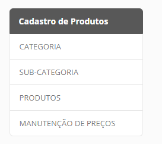
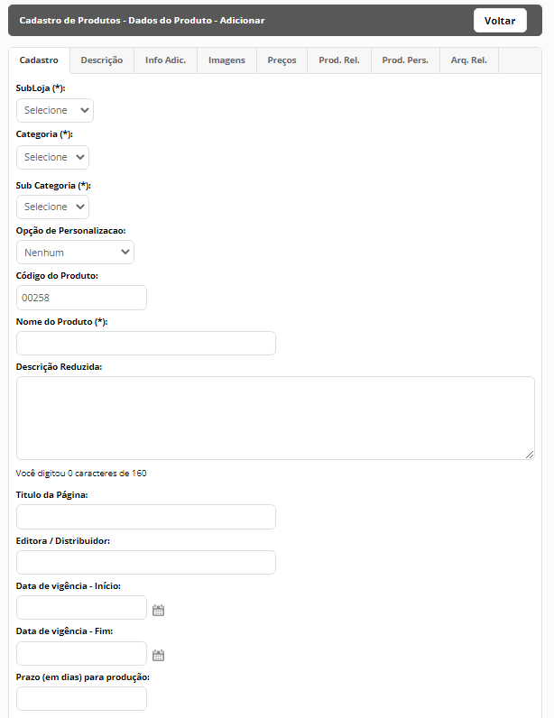
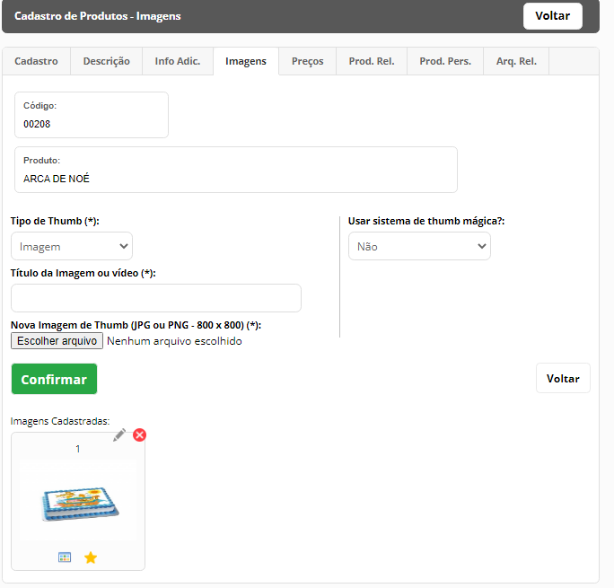
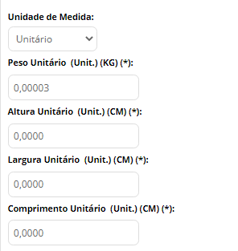
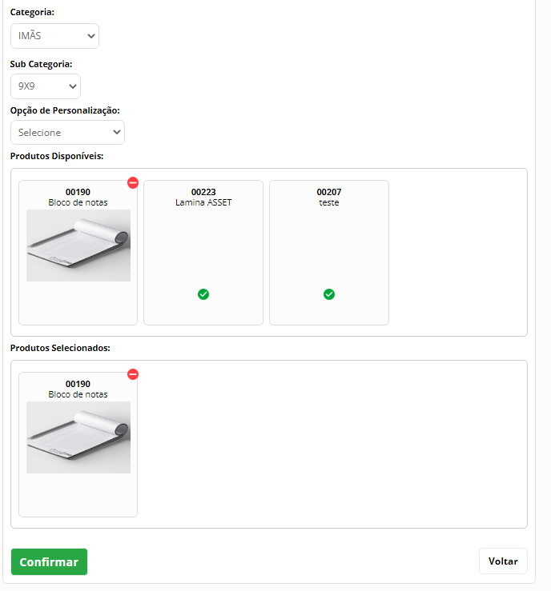
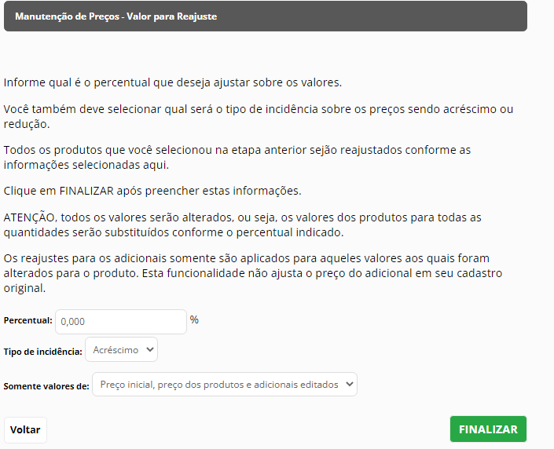
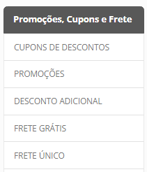
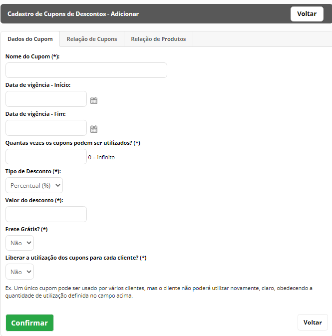
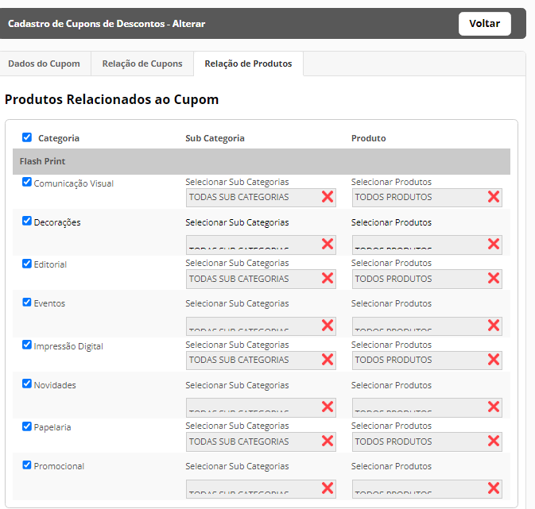

# Produtos

O **módulo de Produtos da Universo Ink** permite com que você realize o gerenciamento de seus produtos por meio de uma hierarquia composta por três elementos que visam proporcionar uma estrutura organizada de registros, sendo eles: **Categoria, Subcategoria e Produto**

Além disso, neste módulo é possível criar promoções e fretes com variáveis específicas. 

A seguir você será introduzido as mecânicas de criação de produto na Universo Ink.

## Categoria

A Categoria é o primeiro elemento fundamental para o cadastro de produto e consiste num cadastro simples onde o registro é vinculado a subloja correspondente,  preenchido o nome, uma thumb caso a categoria seja colocada em destaque.

Ainda no registro de categoria, temos os campos de **Meta-Description** e **Meta-Keywords** para otimização nos sites de busca.
Caso a categoria possua mais de um produto vinculada a mesma, a loja gera uma página da categoria com todos os produtos listados
Subcategoria.

## Subcategoria

O segundo elemento fundamental para o cadastro de produto é a **Subcategoria**. Consiste num cadastro simples onde o registro é vinculado a categoria correspondente e é definido o título. 

Também na subcategoria estão presentes os campos de **Meta-Description** e **Meta-Keywords** para otimização nos sites de busca.
Caso a subcategoria possua mais de um produto vinculada a mesma, a loja gera uma página de subcategoria com todos os produtos Listados

## Produto

O terceiro e mais importante elemento da estrutura de produtos é cadastrado depois que tivermos pelo menos um registro de categoria e subcategoria vinculados entre si. O cadastro de produto é dividido por abas, sendo elas:

### A configuração do Produto na Universo Ink

Ao contratar a loja de dropshipping da Universo Ink, você terá acesso a um catálogo inicial de produtos variados, incluindo camisetas, moletons e baby looks Esses produtos estarão disponíveis na sua loja com preços de custo previamente definidos, baseados no valor de aquisição direto do fornecedor.

Como administrador, você terá total liberdade para expandir sua loja e criar quantos produtos desejar, sem limites. Para adicionar novos produtos, basta duplicar os registros já existentes na plataforma, que virão automaticamente com os preços de custo atribuídos.

Além disso, você poderá configurar o preço final de venda dos produtos e personalizar os valores de adicionais, sempre respeitando o preço mínimo estipulado com base nos custos pré-definidos. Essa flexibilidade permite que você ajuste sua estratégia de preços para maximizar suas margens e atender às demandas do mercado.

Após realizar a duplicação de uma peça, você poderá editar seu título, descrição e imagens, de modo à deixar o produto da maneira mais clara possível para seus cliente. Além disso, você poderá decidir quais tamanhos e cores você quer disponibilizar para a peça com uma determinada estampa por meio das informações adicionais.

**A configuração de um produto na Universo Ink possui etapas principais:**

- Duplicação do Produto com base no catálogo disponível
- Definição do Título, código e outras informações na aba de **Cadastro**
- Envio da arte para produção da estampa em **Info. Adicionais**
- Atribuição das imagens ilustrativas do produto em **Imagens**
- Definição dos preços individualmente por peça ou pela funcionalidade de **Gestão de Preços**

### Cadastro

Na primeira etapa da Configuração de seu produto, é vinculada a **categoria** e **subcategoria** correspondentes.

É atribuído o Título do produto e código (que é autonumerado ou pode ser customizado pelo administrador). Também é preenchido opcionalmente o campo de descrição reduzida, que é uma frase sucinta e resumida sobre o produto, exibida logo abaixo do título, na loja.

O valor definido no campo “Título da Página” é refletido como ``title`` no HTML e também é exibido na aba do navegador.
O campo de **Editora/Distribuidor** pode ser preenchido caso seja utilizado o XML de produtos para o facebook pois o valor definido nesse campo é definido como o parâmetro ``brand`` no XML.

É possível definir a data de vigência do produto por meio dos campos: **Data de Vigência - Início** e **Data de Vigência – Fim**. Caso os campos fiquem branco, a vigência é considerada perpétua.

Ainda nesta etapa é possível definir se o produto utiliza estoque (não é possível para m² e página avulsa). Ao definir o produto com estoque, será solicitado a quantidade disponível em estoque que será diminuída com base nas compras realizadas e um campo onde você pode definir qual será a quantidade mínima para aviso do sistema, sendo assim, quando o estoque atingir esta quantidade, o sistema classificará o produto como **Estoque Baixo**.

O produto pode ser definido como **”Em Lançamento”**, **”Mais Vendido”** ou  **”Em Destaque”**. Todas essas parametrizações, caso definidas como “Sim”, exibirão o produto na Home Page da Loja, na área correspondente.

?> Lembre-se de sempre vincular o produto a uma subloja, categoria e subcategoria, caso contrário, será retornado erro.

### Descrição
Na aba de descrição, será definida a descrição detalhada do produto, de modo a deixar o mais claro possível para o cliente. A descrição é exibida logo abaixo da biblioteca de imagens na página de detalhes do produto. 
Na caixa para redação da descrição, é possível formatar o texto e o botão para edição do “HTML” também está presente, assim como no registro de Página de Conteúdo.
Os campos de **meta-description** e **meta-keywords** também estão no formulário e serão incorporados no código da página do produto que será criada.

### Info. Adicionais - Arquivos para Produção

Nesta área, você enviará a arte que será utilizada pela produção da Universo Ink para estampar as peças. Sempre envie a arte na melhor qualidade possível como em vetores em .AI ou Corel Draw. O envio de um arquivo bem adequado garante a qualidade da impressão das estampas.

### Imagens
Em imagens é possível enviar para o produto suas *thumbnails* que são as imagens ilustrativas do produto. Elas ficarão disponíveis na página de detalhes do produto e também é possível definir qual será a imagem de destaque que é exibida no card do produto nas listas. Além de imagens, também é possível colocar um vídeo do youtube; para isso, basta preencher o campo **Título da Imagem ou vídeo** com um nome para o vídeo e o campo **URL do vídeo no YouTube** com o link para o vídeo do Youtube.

> Ao duplicar um produto para configuração, a descrição com medidas e atributos da peça duplicada já estarão definidos. É recomendável que estas informações sejam mantidas. Você pode acrescentar mais informações, se desejar.

## Preços

Uma das áreas mais importantes do cadastro é a de precificação. Aqui você poderá, de maneira individual, alterar o preço de seus produtos.

?> A plataforma da Universo Ink mantém os custos das peças de maneira fixa. Você como administrador pode colocar um valor para suas peças que sejam **sempre superiores ao valor de custo**. O valor de custo será repassado ao fornecedor de peças, responsável pelo estoque, produção e entrega das camisetas personalizadas. O adicional definido por você, será repassado para sua conta, toda vez que um pedido for pago.

### Produtos Relacionados

Aqui temos uma área semelhante a de *"Cross-Selling"*. É possível vincular outros produtos para que estes sejam disponibilizados em uma área de *"Compre Também"*, na página de detalhes do produto, como um atalho. Para isso, selecione a categoria de produtos e então clique no ícone verde para selecioná-lo. Depois, confirme para efetuar sua operação. 

## Gestão de Preços

A funcionalidade de Gestão de Preços será uma das suas principais aliadas na definição dos valores de suas peças. Com ela, você pode selecionar produtos e aplicar ajustes percentuais nos preços, seja para aumentá-los ou reduzi-los, de forma prática e estratégica.

Primeiramente, o administrador seleciona quais serão as categorias de produtos, depois seleciona as subcategorias e por fim os produtos que terão os preços alterados.

Após avançar a esta etapa, é definido qual o tipo de mudança (Acréscimo ou Redução) e o valor em porcentagem da alteração. Também é possível selecionar se a alteração será realizada nos produtos, nos adicionais ou em ambos.

Após realizar a configuração da alteração, clique em Concluir para finalizar e o sistema realizará o processo, alterando os preços dos produtos. Logo após a conclusão, você será redirecionado a uma página que exibirá uma tabela com as seguintes informações:

- **Nome do Produto Alterado**
- **Valor de Custo (R$)** (Valor que será repassado à Produção da Universo Ink)
- **Margem de Lucro (%)** (Markup percentual sobre o valor de custo da peça)
- **Preço de Venda (R$)** (Valor que será praticado na loja, para seus clientes)
- **Lucro do Produto (R$)** (Valor que será repassado a você)

Essas informações garantem transparência e exibe de maneira clara como as políticas de preços dos seus produtos serão praticadas na loja. As mesmas informações também podem ser encontradas no **Relatório de Gerenciamento de Preços**.

?> Essa operação não pode ser desfeita portanto há de se ter muita atenção ao realizar este procedimento. Se você realizar um acréscimo de 10% nos produtos por engano, reduzir 10% não resolverá o problema.

## Promoções, Cupons e Frete

A parte de promoções da plataforma oferece várias funcionalidades que visam proporcionar ao administrador tratativas e condições que sejam vantajosas e atrativas aos seus clientes. Nesta área será possível aplicar condições de promoção específicas aos seus clientes.

### Cupons de Desconto

Com os Cupons de Desconto você disponibilizará para seu cliente um código para utilização no carrinho de compras que dará descontos ao pedido ou em determinados produtos.

No cadastro de Cupom, você definirá primeiramente o nome do cupom de desconto. Defina a data de início e fim da vigência e quantas vezes o cupom pode ser utilizado.

?> O nome definido nesta etapa não é o código do cupom que o cliente digitará no Carrinho de Compras. Este nome serve apenas para registro e referência na sua lista de cupons.

É definido também o tipo de desconto, se é percentual (%) ou valor fixo (R$) e o valor. 

O cupom também pode dar frete grátis. Selecione no campo a opção **"Sim"** se quiser esta condição e selecione quais fretes disponíveis na loja ficará grátis caso o cliente utilize o cupom.

Há também a variável de **Mínimo de Valor** no campo **Aplicar para compras acima de**. Aqui é definido um valor mínimo para vigência do cupom. O cupom ficará válido somente se o valor no carrinho ser o mesmo ou ultrapassar este valor.

O campo **"Liberar a utilização dos cupons para cada cliente?"** está diretamente ligado ao campo de número de utilizações. Caso você defina como sim, cada cliente seu terá direito a utilizar o cupom com base na quantidade definida no campo de número de utilizações. Se não, o número definido no campo de número de utilizações é a quantidade total compartilhada para todos os clientes.

Na aba de Cupons de Desconto, você realizará o cadastro dos nomes dos cupons que o cliente digitará no campo no Carrinho da Loja.

Faça o upload dos cupons que deseja inserir na loja. Esta relação você poderá cirar em Excel ou em arquivo de texto (bloco de notas). O Arquivo deve ser salvo em **CSV**. Lembre-se de que nesta relação deverá constar apenas os códigos dos cupons. Nesta área você deve selecionar como o sistema deve ler seu documento, portanto, se você colocou os valores um embaixo do outro, por exemplo, deve selecionar a opção **Quebra de Linha (Enter)**

Caso queira vincular um cupom a um determinado cliente, você poderá informar o CPF ou CNPJ do cliente logo após o número do cupom seguido pelo sinal de ``"="`` (igual), basta colocar: ``"=xxx.xxx.xxx-xx"`` se for CPF ou ``"=xx.xxx.xxx/xxxx-xx"`` se for CNPJ onde o "x" representa o número do CPF ou CNPJ. Desta forma o cupom só poderá ser utilizado por aquele cliente.

Após subir o seu documento preenchido, os cupons serão refletidos na lista com a indicação de quantas vezes foram utilizados e se estão vinculados a clientes específicos.

Em **Relação de Produtos** é vinculado ao cupom os produtos que terão seus preços alterados quando o cupom for utilizado. É possível selecionar todos os produtos da loja assim como produtos específicos.

 ### Promoções

 A parte de promoções permite com que sejam criadas promoções tradicionais que serão propagadas em sua loja. O registro consiste em um cadastro simples onde é atribuído o nome da promoção que servirá para referência na lista, o valor do desconto em porcentagem (%) e a data de vigência da promoção.

 Em **"Relação de Produtos"**, são selecionados os produtos que farão parte da promoção.

 Após finalizar a operação, a promoção ficará vigente na loja.

 ### Desconto Adicional

 O desconto adicional é um tipo de promoção condicionada à quantidade de cada produto de categoria/subcategoria é colocada no carrinho. O desconto é aplicado somente quando a quantidade definida no campo **Aplicar desconto quando a soma da quantidade de cada item / categoria / subcategoria forem acima de:**. O desconto é atribuído na forma de Porcentagem (%) e também é possível definir uma data de vigência. 

 Em **"Relação de Produtos"**, são selecionados os produtos que farão parte do desconto adicional.

Após finalizar a operação, a promoção ficará vigente na loja.

### Frete Grátis

Na funcionalidade de Frete Grátis é possível criar uma promoção que oferece Frete Grátis em determinadas opções de frete para clientes que realizem compras com um valor mínimo e/ou estejam dentro de uma região especificada.

É a primeira funcionalidade que utiliza a faixa de cep para parametrização.

Ao criar um novo registro, primeiramente será definida a região de vigência da promoção. Ao selecionar um estado, serão exibidas as cidades com suas respectivas faixas de cep.  

Depois, selecione quais serão os fretes que ficarão grátis.

>São exibidos somente os fretes que estão ativos e vigentes na loja

É possível também definir um valor mínimo de compra, sendo assim, o frete ficará grátis apenas quando houver este valor ou mais no carrinho do cliente.

A data de vigência também pode ser definida na promoção de frete grátis.

 Em **"Relação de Produtos"**, são selecionados os produtos que farão parte da promoção e estarão diretamente ligados ao campo de **Apenas para as compras acima de**.

 ### Frete Único

 Com o **Frete Único** é possível a criação de um frete próprio do administrador que pode ir desde uma retirada em balcão até um frete de Motoboy próprio da empresa. 

 Assim como em **Frete Grátis**, o Frete Único utiliza a relação de faixas de CEP para especificação de vigência por região.

 No registro, primeiramente dê um nome ao frete único e então defina se este será retirada em balcão ou se será um frete de envio. Depois, selecione quais serão as cidades que terão o frete vigente. 

 Em **Apenas para as compras acima de**, defina um valor mínimo de compra para que o frete seja exibido, caso haja.

 No campo **Apenas para os pesos entre** atribua um mínimo e máximo de peso do frete e, logo abaixo, atribua uma data de vigência para o frete, caso seja de tempo limitado.

O frete pode ser definido como *"Grátis"* ao selecionar *Sim* no campo **"Frete Grátis?"**. 

É possível estabelecer um valor extra para cada quilo adicional do pedido no campo **"Valor do frete para cada KG adicional"**. Desta forma, será acrescentado o valor estabelecido com base no peso do pedido.

> Por exemplo, se o frete tem o valor de R$15,00 e o valor do quilo adicional for de R$2,00, caso o pedido tenha 1 KG, o frete será de R$17,00; 2 quilos = R$19,00; 3 quilos = R$21,00 e assim por diante até que o peso máximo do frete seja atingido.

E no último campo é definido o prazo de entrega em dias.

?> O prazo de entrega é somado ao prazo de produção e informado para o cliente no checkout do pedido.

## Lista de Filtros Adicionais

Da mesma forma que na lista de **Características Adicionais**, os **Filtros Adicionais** cadastrados em Database são exibidos em uma lista na parte de Produtos. Depois de cadastrar a lista dos filtros em **Database**, acesse o módulo de **Produtos** e visualize seu registro criado na parte de **Filtros Adicionais** na barra lateral esquerda. Clique no registro e então cadastre os filtros desejados. Depois, acesse o produto e vincule os filtros por meio da área de **Info Adicionais**.

